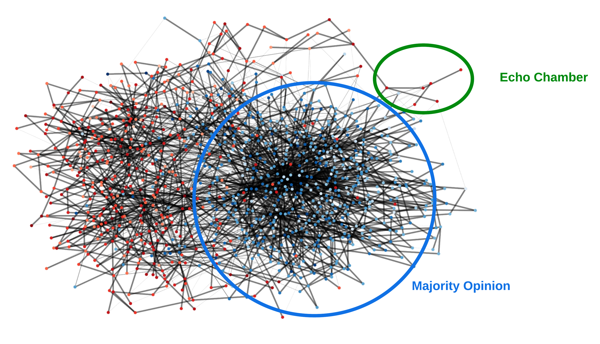
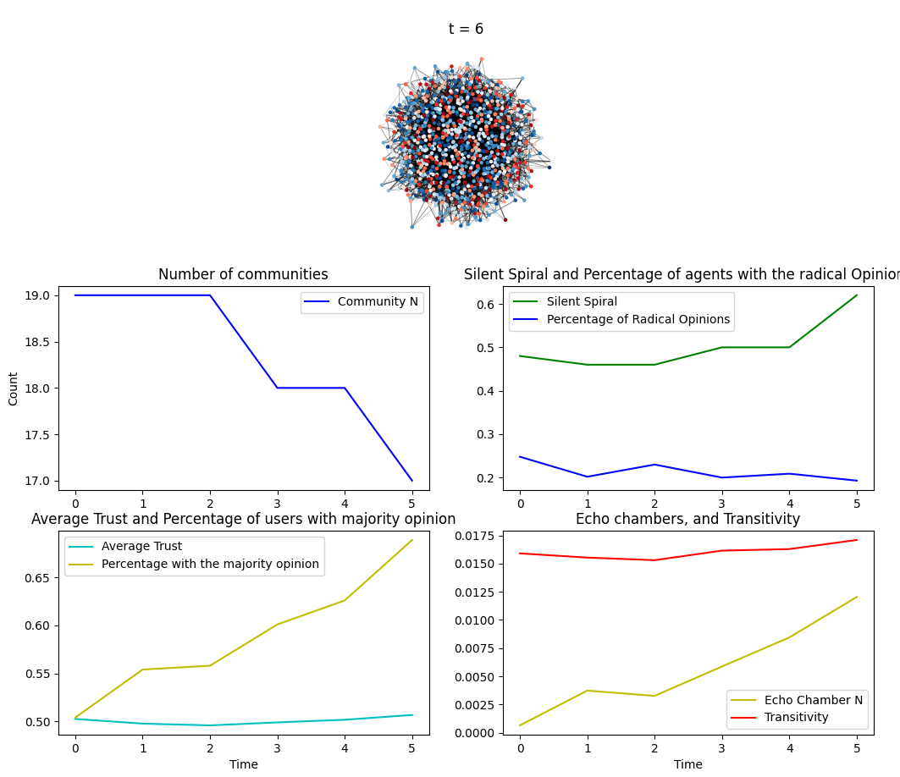
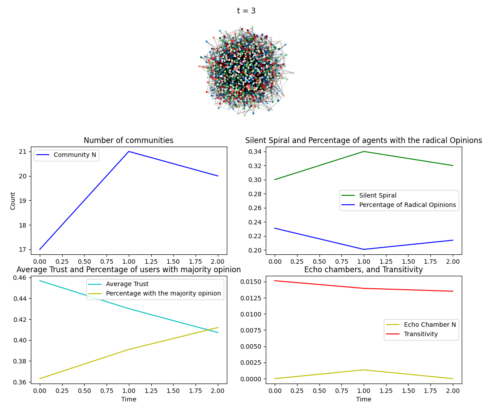

<table align="center"><tr><td align="center" width="9999">


# Investigating social phenomena prevalent in online covid-19 discourse through network-agent based modelling

  Anthony Reidy
</td></tr></table>

## Table of contents 
- [Install](#install)
- [Report](#report)
- [Usage](#usage)
- [GUI explanation](#gui)
- [File explanation](#file-explanation)

## Install
It is good practice to develop in a virtual environment. Note, this code contained in this assignment was written using `python 3.8` and on the `Ubuntu` (Linux) operating system (OS). As such, all commands are setup for this installation and may not work for other OS's. To create a virtual environment called `venv`, execute:
```bash
python3 -m venv venv
```
To activate it, execute
```bash
source venv/bin/activate
```

- Execute `pip3 install -r requirements.txt` to install requirements for development.

## Report
The report for this assignment can be found [here](report.pdf).

## Usage
```bash 
$ python3 model.py --help 
Usage: model.py [options]

Options:
  -h, --help            show this help message and exit
  -n NUM_AGENTS, --num_agents=NUM_AGENTS
                        Number of agents in network.
  -l N_NEIGHBORS, --n_neighbors=N_NEIGHBORS
                        Number of neighbors for each node
  -t NETWORK_TYPE, --network_type=NETWORK_TYPE
                        1 for small-world, 2 for scale free
  -b BETA_COMPONENT, --beta_component=BETA_COMPONENT
                        if network type is small world (1); this is the beta-
                        component
  -s SIMILARITY_TRESHOLD, --similarity_treshold=SIMILARITY_TRESHOLD
                        Range in which similarity holds
  -i SOCIAL_INFLUENCE, --social_influence=SOCIAL_INFLUENCE
                        The influence of neighboring agents on the forming of
                        a new preference.
  -w SWINGERS, --swingers=SWINGERS
                        Number of agents which switches opinion, preference,
                        and trust with each timestep.
  -v MALICIOUS, --malicious=MALICIOUS
                         Number of malicious agents
  -e ECHO_LIMIT, --echo_limit=ECHO_LIMIT
                        Limit for edge strength (weight) for echo chamber
                        calculation.
  -m ALL_MAJORITY, --all_majority=ALL_MAJORITY
                         If true: all agents except malicious agents have the
                        same opinion
  -o OPINIONS, --opinions=OPINIONS
                        Number of opinions 
```

## GUI

### GUI with two opinions



### GUI with three opinions


The graphical user interface has four main components:

1. **Network visualisation (upper left)**: The upper left panel displays the network. The colour of each node indicates it's opinion where as the strength of the color shade indicates its preference. 
2. **Number of communities (upper right)**: Time series graph displaying  communities over time t as defined by the Louvain algorithm.
3. **Silent Spiral, Transitivity, Echo Chambers and percentage of agents with radical opinions (bottom left)**: Time series graph displaying the number of silent spirals, Transitivity, the percentage of echo chambers over all [cliques](https://networkx.org/documentation/stable/reference/algorithms/generated/networkx.algorithms.clique.enumerate_all_cliques.html#networkx.algorithms.clique.enumerate_all_cliques) and the percentage of agents with radical opinions over time t.
4. **Average Trust,percentage of agents with majority opinion (bottom right)**: Time series graph displaying the average trust and percentage of agents with the majority opinion throughout the network. 

## File explanation
**model.py** A python module that contains the majority of the code related to the model. It describes the initialization strategy (random activation), the update steps and the time series graphs visualisation.
**Analysis.py** A python module that contains "compute functions" for the output parameters e.g. echo chamber count
**Visualization.py** Code required to visualize the network. I decided to put this into a separate file given the size of the code required. 

